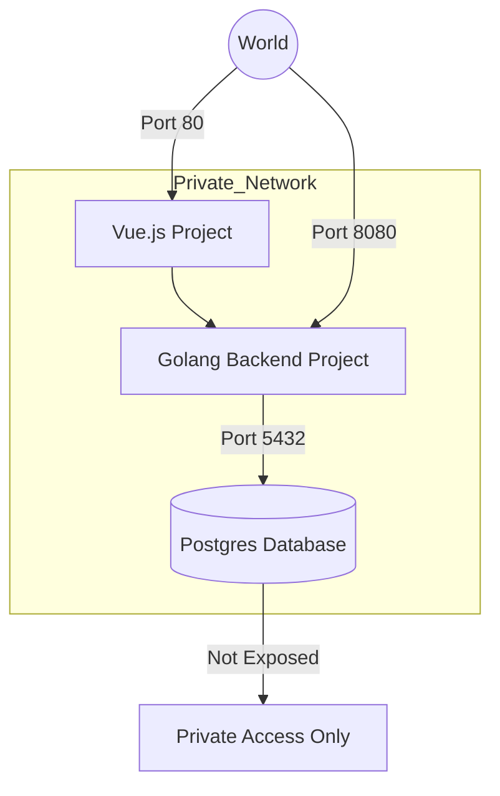
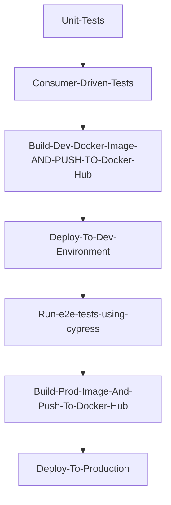

# Run in production

To deploy backend project in production you need:

- SSH access
- a VPS with docker installed

ssh to your vps and follow this commands:

```bash
wget wget https://raw.githubusercontent.com/playsoil/todo-go/refs/heads/master/docker-compose-prod.yml

# change variables with your desired values
COMPOSE_PROJECT_NAME=prod-todo-app IMAGE_TAG=latest DB_USER=prod_todos_user DB_PASSWORD=prod_todos_pass DB_NAME=prod_todos APP_PORT=8080 docker compose -f docker-compose-prod.yml up -d

```

now visit

# Do you want a UI?!

```bash
wget wget https://raw.githubusercontent.com/playsoil/todo-ui/refs/heads/master/docker-compose-prod.yml -O  docker-compose-prod-ui.yml


# change variables with your desired values
COMPOSE_PROJECT_NAME=prod-todo-app IMAGE_TAG=latest  docker compose -f docker-compose-prod-ui.yml up -d

```

# Architect

### Key components

- a backend project which holds logic
- a database to store and persist data
- a front and project for user interface
- a private network



### key notes

- Each environment (dev or prod) adopts exact same architect
- Postgres database is not exposed and is not available in outside world, it's also better to not expose todo-go project, because all three services are in the same private network by using frameworks like nuxt.js or next.js it is completely achievable.
- I used RestAPI for communication between server-side and client-side, which is pretty straight forward
- the creation of new task is synchronous communication, it is not resource or time consuming.

# CI CD Pipeline

### overview:



### Key notes

- Docker and docker compose are the backbone of running and deploying project
- Images are stored in public docker hub
- I use image:dev tag for dev environment and image:latest tag for production

### Github workflow files

- build.yml: which is responsible to build the image and push it to image repository
- deploy.yml: which is responsible to update apps and containers. I decided to use very simple ssh commands to update pull images and restart containers. but there is other options like swarm, or for large scale projects maybe kubernetes can be an option.
- e2e.yml: which runs end to end tests using cypress against DEV environment
- ci-cd.yml: it's the main workflow, it is the orchestrate of our continuous integration and continuous development process. this file runs all ci cd steps as shown in above diagram. also running unit tests are inside this workflow
- unit tests and consumer contract tests also run in ci-cd.yml file

# Tech Stack

#### Back end project

    - golang
    - gofiber
    - gorm
    - go-sqlmock

#### Front project

    - typescript
    - vuejs 3
    - vitest
    - cypress

#### Database

    - postgres

### Infrastructure

    - Docker
    - Docker compose
    - Github Actions
    - Docker hub
    - Ubuntu

# What is left?

- consumer test is not completed and the provider section is left. write now only consumer test part is completed.
- in my opinion it is good idea to NOT deploy to production without human feedback. based on what.
